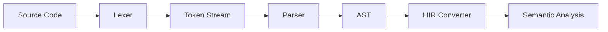

# Abstract Syntax Tree (AST) Overview

The Abstract Syntax Tree (AST) is the core data structure representing the syntactic structure of source code after parsing. It provides a hierarchical, tree-like representation that captures the essential grammatical relationships while abstracting away lexical details like parentheses and whitespace.

## Architecture

RCompiler uses a **variant-based AST design** instead of traditional inheritance hierarchies. This approach provides:

- **Type Safety**: Compile-time guarantees about node types
- **Memory Efficiency**: No virtual function overhead
- **Pattern Matching**: Modern C++ visitor patterns with `std::visit`
- **Extensibility**: Easy to add new node types

## Core Components

### Node Categories

1. **Expressions** ([`src/ast/expr.hpp`](../../src/ast/expr.hpp))
   - Arithmetic operations (`+`, `-`, `*`, `/`)
   - Logical operations (`&&`, `||`, `!`)
   - Comparisons (`==`, `!=`, `<`, `>`)
   - Literals (integers, booleans, strings)
   - Variable references and function calls

2. **Statements** ([`src/ast/stmt.hpp`](../../src/ast/stmt.hpp))
   - Variable declarations and assignments
   - Control flow (`if`, `while`, `for`)
   - Return statements
   - Expression statements
   - Block statements

3. **Items** ([`src/ast/item.hpp`](../../src/ast/item.hpp))
   - Function definitions
   - Struct definitions
   - Module imports
   - Type aliases

4. **Types** ([`src/ast/type.hpp`](../../src/ast/type.hpp))
   - Primitive types (`i32`, `bool`, `str`)
   - Composite types (arrays, tuples, structs)
   - Function types
   - Type parameters

5. **Patterns** ([`src/ast/pattern.hpp`](../../src/ast/pattern.hpp))
   - Literal patterns
   - Variable patterns
   - Struct patterns
   - Wildcard patterns

### Supporting Infrastructure

- **Common Types** ([`src/ast/common.hpp`](../../src/ast/common.hpp)): Shared utilities and type definitions
- **Visitor Pattern** ([`src/ast/visitor/`](../../src/ast/visitor/)): Type-safe tree traversal
- **Pretty Printing** ([`src/ast/pretty_print/`](../../src/ast/pretty_print/)): AST visualization and debugging

## Key Design Decisions

### Variant-Based Nodes
Instead of class hierarchies with virtual functions, RCompiler uses `std::variant`:

```cpp
// Traditional approach
class Expr {
public:
    virtual ~Expr() = default;
    virtual void accept(Visitor& v) = 0;
};

class BinaryExpr : public Expr { ... };

// Variant-based approach
using Expr = std::variant<
    LiteralExpr,
    BinaryExpr,
    VariableExpr,
    // ... other expression types
>;
```

**Benefits:**
- No dynamic dispatch overhead
- Compile-time exhaustiveness checking
- Easy serialization/deserialization
- Better integration with modern C++ patterns

### Visitor Pattern Implementation

The AST uses the **CRTP visitor pattern** for type-safe traversals:

```cpp
template<typename Derived>
class VisitorBase {
    Derived& derived() { return static_cast<Derived&>(*this); }
    
public:
    void visit(const Expr& expr) {
        std::visit([&](const auto& specific) {
            derived().visit_specific(specific);
        }, expr);
    }
};
```

## Data Flow



## Navigation

- **Implementation Details**: See [`src/ast/`](../../src/ast/) directory
- **Visitor Pattern**: [`src/ast/visitor/visitor_base.hpp`](../../src/ast/visitor/visitor_base.hpp:1)
- **Node Definitions**: Individual header files for each node category
- **Utilities**: [`src/ast/common.hpp`](../../src/ast/common.hpp:1) for shared types

## Related Documentation

- [Parser Overview](./parser-overview.md) - How AST is constructed
- [Semantic Analysis Overview](./semantic-overview.md) - How AST is processed
- [HIR Overview](./semantic-overview.md) - Semantic representation
- [Architecture Guide](../architecture.md) - System-wide design decisions

## Usage Examples

### Creating AST Nodes
```cpp
// Create a binary expression: a + b
auto expr = Expr(BinaryExpr{
    BinaryOp::Add,
    VariableExpr{"a"},
    VariableExpr{"b"}
});

// Create a function definition
auto func = Item(FunctionDef{
    "add",
    {{"a", Type{i32}}, {"b", Type{i32}}},
    Type{i32},
    std::move(expr)
});
```

### Visiting AST
```cpp
class ExprPrinter : public VisitorBase<ExprPrinter> {
public:
    void visit_specific(const LiteralExpr& expr) {
        std::cout << expr.value;
    }
    
    void visit_specific(const BinaryExpr& expr) {
        std::cout << "(";
        visit(expr.left);
        std::cout << " + ";
        visit(expr.right);
        std::cout << ")";
    }
};
```

This AST design provides a solid foundation for compiler phases while maintaining type safety and performance characteristics essential for educational compiler development.