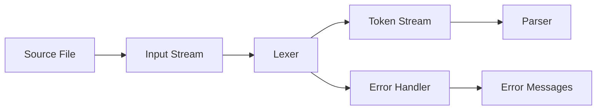

# Lexer Overview

The Lexer (lexical analyzer) is responsible for converting source code text into a stream of tokens. It's the first phase in the compilation pipeline, transforming raw character input into structured lexical units that the parser can consume.

## Architecture

RCompiler's lexer uses a **single-pass design** with **position tracking** for precise error reporting. The lexer processes the input stream character by character, identifying tokens and maintaining location information throughout the process.

## Core Components

### Main Lexer ([`src/lexer/lexer.hpp`](../../src/lexer/lexer.hpp))

The lexer class provides the primary interface for tokenization:

- **Token Recognition**: Identifies keywords, identifiers, literals, operators, and delimiters
- **Position Tracking**: Maintains line and column information for error reporting
- **Error Handling**: Provides detailed error messages with source locations
- **Stream Interface**: Consumes input through an abstract stream interface

### Input Stream ([`src/lexer/stream.hpp`](../../src/lexer/stream.hpp))

The stream abstraction provides:

- **Character Access**: Sequential access to input characters
- **Position Management**: Tracks current position in source file
- **Lookahead**: Limited peek capability for multi-character tokens
- **EOF Detection**: Handles end-of-input conditions

## Token Types

The lexer produces tokens for:

### Literals
- **Integer literals**: `42`, `0x1F`, `0b1010`
- **String literals**: `"hello"`, `"world\n"`
- **Boolean literals**: `true`, `false`
- **Character literals**: `'a'`, `'\n'`

### Identifiers and Keywords
- **Identifiers**: `variable_name`, `function_name`, `MyStruct`
- **Keywords**: `fn`, `let`, `if`, `else`, `while`, `return`, `struct`

### Operators and Delimiters
- **Arithmetic**: `+`, `-`, `*`, `/`, `%`
- **Comparison**: `==`, `!=`, `<`, `<=`, `>`, `>=`
- **Logical**: `&&`, `||`, `!`
- **Assignment**: `=`, `+=`, `-=`, `*=`, `/=`
- **Delimiters**: `(`, `)`, `{`, `}`, `[`, `]`, `,`, `;`, `:`, `.`

### Special Tokens
- **End of File**: Marks successful completion of tokenization
- **Invalid**: Represents unrecognized characters (error condition)

## Key Design Decisions

### Position Tracking
Every token includes precise location information:

```cpp
struct Position {
    size_t line;
    size_t column;
    size_t offset;
};

struct Token {
    TokenType type;
    std::string value;
    Position start;
    Position end;
};
```

**Benefits:**
- Precise error messages: "Error at line 5, column 12: unexpected token"
- IDE integration: Jump to exact error location
- Debugging support: Map tokens back to source code

### Stream-Based Design
The lexer uses an abstract stream interface rather than direct string access:

```cpp
class InputStream {
public:
    virtual char peek() = 0;
    virtual char next() = 0;
    virtual Position position() const = 0;
    virtual bool at_end() const = 0;
};
```

**Benefits:**
- Testability: Easy to mock for unit tests
- Flexibility: Can handle different input sources (files, strings, memory)
- Consistency: Uniform interface for all input types

### Single-Pass Processing
The lexer processes input in a single forward pass:

```cpp
class Lexer {
    Token parse_next_token() {
        // Skip whitespace
        skip_whitespace();
        
        // Identify token type
        if (is_digit(current_char())) return parse_number();
        if (is_alpha(current_char())) return parse_identifier();
        if (is_operator(current_char())) return parse_operator();
        // ... other token types
    }
};
```

**Benefits:**
- Efficiency: No backtracking or multiple passes
- Simplicity: Clear, linear processing logic
- Memory efficiency: Minimal buffering requirements

## Data Flow



## Error Handling

The lexer provides comprehensive error reporting:

### Error Types
- **Invalid Character**: Unrecognized character in source
- **Unterminated String**: Missing closing quote
- **Invalid Number**: Malformed numeric literal
- **Unexpected EOF**: Incomplete input

### Error Information
Each error includes:
- **Location**: Line and column where error occurred
- **Context**: Surrounding source code snippet
- **Message**: Human-readable description
- **Recovery**: Attempt to continue parsing after error

## Navigation

- **Implementation Details**: See [`src/lexer/`](../../src/lexer/) directory
- **Main Lexer**: [`src/lexer/lexer.hpp`](../../src/lexer/lexer.hpp:42)
- **Stream Interface**: [`src/lexer/stream.hpp`](../../src/lexer/stream.hpp:1)
- **Usage Examples**: Test files in [`test/lexer/`](../../test/lexer/)

## Related Documentation

- [AST Overview](./ast-overview.md) - How tokens are used to build AST
- [Parser Overview](./parser-overview.md) - Token consumption and AST construction
- [Architecture Guide](../architecture.md) - System-wide design decisions

## Usage Examples

### Basic Tokenization
```cpp
// Create lexer from file
auto stream = std::make_unique<FileStream>("source.rx");
auto lexer = Lexer(std::move(stream));

// Tokenize input
std::vector<Token> tokens;
while (!lexer.at_end()) {
    auto token = lexer.next_token();
    if (token.type != TokenType::Invalid) {
        tokens.push_back(token);
    } else {
        handle_error(token);
    }
}
```

### Error Handling
```cpp
try {
    auto tokens = tokenize_file("source.rx");
    // Process tokens...
} catch (const LexerError& error) {
    std::cerr << "Lexer error: " << error.message() << std::endl;
    std::cerr << "Location: " << error.position().line 
              << ":" << error.position().column << std::endl;
}
```

This lexer design provides a robust foundation for the compilation pipeline with excellent error reporting and maintainability characteristics essential for educational compiler development.