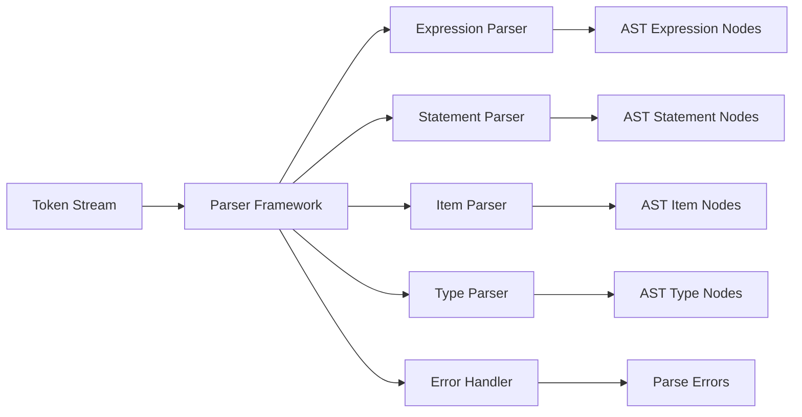

# Parser Overview

The Parser is responsible for converting a stream of tokens from the lexer into a structured Abstract Syntax Tree (AST). It implements the syntactic analysis phase, establishing the grammatical relationships between tokens according to the language specification.

## Architecture

RCompiler's parser uses a **parser combinator approach** inspired by the Haskell Parsec library. This functional programming style enables modular composition of parsing logic and provides excellent error handling capabilities.

## Core Components

### Parser Framework ([`src/parser/parser.hpp`](../../src/parser/parser.hpp))

The main parser framework provides:

- **Combinator Library**: Functional parser composition primitives
- **Error Handling**: Detailed error reporting with expected tokens
- **Backtracking**: Automatic backtracking for ambiguous parses
- **Modular Design**: Separate parsers for different language constructs

### Specialized Parsers

#### Expression Parser ([`src/parser/expr_parse.cpp`](../../src/parser/expr_parse.cpp))
Handles expression parsing with **Pratt parsing** for operator precedence:

- **Binary Operations**: `+`, `-`, `*`, `/`, `==`, `!=`, `<`, `>`
- **Unary Operations**: `-`, `!`, `*` (dereference)
- **Function Calls**: Identifier with argument list
- **Literals**: Numbers, strings, booleans
- **Parentheses**: Grouping and precedence control

#### Statement Parser ([`src/parser/stmt_parse.cpp`](../../src/parser/stmt_parse.cpp))
Parses various statement types:

- **Variable Declarations**: `let x = 42;`, `mut y = "hello";`
- **Assignments**: `x = 5;`, `y += 3;`
- **Control Flow**: `if`, `while`, `for`, `loop`
- **Return Statements**: `return value;`, `return;`
- **Expression Statements**: Function calls, assignments

#### Item Parser ([`src/parser/item_parse.cpp`](../../src/parser/item_parse.cpp))
Parses top-level program items:

- **Function Definitions**: `fn add(a: i32, b: i32) -> i32 { ... }`
- **Struct Definitions**: `struct Point { x: f64, y: f64 }`
- **Module Imports**: `use std::io;`
- **Type Aliases**: `type UserId = i64;`

#### Type Parser ([`src/parser/type_parse.cpp`](../../src/parser/type_parse.cpp))
Handles type expressions:

- **Primitive Types**: `i32`, `f64`, `bool`, `str`
- **Composite Types**: Arrays `[T]`, tuples `(T, U)`, structs `Struct { ... }`
- **Function Types**: `fn(T) -> U`, `fn(T, U) -> V`
- **Generic Types**: `Option`, `Result`, `Vec`

#### Pattern Parser ([`src/parser/pattern_parse.cpp`](../../src/parser/pattern_parse.cpp))
Parses pattern matching constructs:

- **Literal Patterns**: `42`, `"hello"`, `true`
- **Variable Patterns**: `x`, `name`
- **Struct Patterns**: `Point { x, y }`
- **Wildcard Patterns**: `_`
- **Alternative Patterns**: `Some(x) | None`

#### Path Parser ([`src/parser/path_parse.cpp`](../../src/parser/path_parse.cpp))
Handles module paths and qualified names:

- **Simple Identifiers**: `variable`, `function_name`
- **Module Paths**: `std::io::println`, `crate::module::item`
- **Type Paths**: `Vec`, `Option`, `Result<T, E>`

### Supporting Infrastructure

- **Common Utilities** ([`src/parser/common.hpp`](../../src/parser/common.hpp)): Shared parser combinators
- **Parser Registry** ([`src/parser/parser_registry.hpp`](../../src/parser/parser_registry.hpp)): Dynamic parser registration
- **Utilities** ([`src/parser/utils.hpp`](../../src/parser/utils.hpp)): Helper functions and macros

## Key Design Decisions

### Parser Combinator Approach

Instead of traditional hand-written recursive descent, RCompiler uses functional parser combinators:

```cpp
// Basic combinators
auto digit = satisfy(is_digit);
auto identifier = many1(alpha) << many(alnum_digit);
auto number = many1(digit) >>= [](auto digits) { 
    return std::stoi(digits); 
};

// Composition
auto term = number | identifier | parenthesized_expression;
auto expression = term >> many((char_('+') >> term) | (char_('-') >> term));
```

**Benefits:**
- **Composition**: Small parsers combine to create complex ones
- **Reusability**: Common patterns (identifiers, numbers) reused everywhere
- **Testability**: Each parser can be unit tested independently
- **Error Handling**: Automatic error propagation and context

### Pratt Parsing for Expressions

Uses Pratt parsing for handling operator precedence and associativity:

```cpp
// Operator precedence table
std::unordered_map<std::string, int> precedence = {
    {"+", 1}, {"-", 1}, {"*", 2}, {"/", 2},
    {"==", 0}, {"!=", 0}, {"<", 0}
};

// Parsing loop
auto parse_expression(int min_prec) {
    auto left = parse_primary();
    while (current_token_precedence() >= min_prec) {
        auto op = consume_operator();
        auto right = parse_expression(op.precedence + 1);
        left = BinaryExpr{op, left, right};
    }
    return left;
}
```

**Benefits:**
- **Correct Precedence**: Handles complex expression hierarchies
- **Associativity**: Proper left/right associativity
- **Extensibility**: Easy to add new operators
- **Performance**: No recursion for common expressions

### Error Recovery

The parser implements sophisticated error handling:

```cpp
class ParseError : public std::exception {
public:
    ParseError(const std::string& message, 
               const Token& expected,
               const Token& actual,
               const Position& position)
        : message_(format_error(message, expected, actual, position)),
          position_(position) {}
    
    const std::string& message() const { return message_; }
    const Position& position() const { return position_; }
};
```

**Features:**
- **Expected Tokens**: Shows what parser was expecting
- **Actual Tokens**: Shows what was found instead
- **Precise Location**: Line and column information
- **Recovery**: Attempts to continue parsing after errors

### Parser Registry System

Dynamic registration of parser components:

```cpp
class ParserRegistry {
public:
    template<typename T>
    void register_parser(const std::string& name) {
        parsers_[name] = std::make_unique<T>();
    }
    
    ParserBase* get_parser(const std::string& name) {
        return parsers_[name].get();
    }
};
```

**Benefits:**
- **Modularity**: Parsers can be developed independently
- **Extensibility**: New language features added as modules
- **Testing**: Each parser can be tested in isolation
- **Configuration**: Parser selection can be configured

## Data Flow



## Grammar Support

The parser handles a C-like subset of Rust with these constructs:

### Expressions
```rust
// Arithmetic
a + b * (c - d)
x / y % z

// Logical
condition1 && condition2 || condition3
!flag

// Comparisons
x == y
a != b
value < limit
```

### Statements
```rust
// Variable declarations
let x: i32 = 42;
mut counter = 0;

// Control flow
if condition {
    // then branch
} else {
    // else branch
}

while condition {
    // loop body
}

return value;
```

### Items
```rust
// Function definition
fn add(a: i32, b: i32) -> i32 {
    return a + b;
}

// Struct definition
struct Point {
    x: f64,
    y: f64
}
```

## Navigation

- **Implementation Details**: See [`src/parser/`](../../src/parser/) directory
- **Main Framework**: [`src/parser/parser.hpp`](../../src/parser/parser.hpp:1)
- **Parser Combinators**: [`lib/parsecpp/include/parsec.hpp`](../../lib/parsecpp/include/parsec.hpp:1)
- **Usage Examples**: Test files in [`test/parser/`](../../test/parser/)

## Related Documentation

- [Lexer Overview](./lexer-overview.md) - Token production and stream
- [AST Overview](./ast-overview.md) - Tree structure and node types
- [Semantic Analysis Overview](./semantic-overview.md) - AST processing
- [Architecture Guide](../architecture.md) - System-wide design decisions

## Usage Examples

### Basic Parsing
```cpp
// Create parser
auto parser = Parser();

// Parse tokens from lexer
auto tokens = lexer.tokenize(source_code);
auto ast = parser.parse(tokens);

if (ast.has_errors()) {
    for (const auto& error : ast.errors()) {
        std::cerr << "Parse error: " << error.message() << std::endl;
        std::cerr << "At line " << error.position().line << std::endl;
    }
}
```

### Custom Parser Development
```cpp
// Define a new parser combinator
auto parse_custom_construct() {
    return string("custom") >> 
           char_('(') >> 
           many(parse_identifier) >> 
           char_(')') >>= 
           [](auto name) {
               return CustomConstruct{name};
           };
}

// Register the parser
registry.register_parser<CustomParser>("custom_construct");
```

This parser design provides excellent modularity, testability, and extensibility while maintaining the performance characteristics needed for educational compiler development.