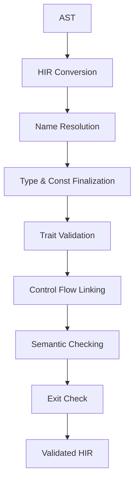

# Semantic Analysis Overview

Semantic analysis transforms the parsed AST into a validated High-Level IR (HIR) through a sequence of explicit visitor passes. The pipeline is orchestrated in `cmd/semantic_pipeline.cpp` and each pass tightens invariants that the following pass relies on.

## Architecture

- Visitor-based passes run on a shared HIR data model and communicate through resolved pointers and `TypeId` handles rather than a query system.
- Pipeline order: **HIR Conversion → Name Resolution → Type & Const Finalization → Trait Validation → Control Flow Linking → Semantic Checking → Exit Check**.
- Shared infrastructure: HIR nodes (`src/semantic/hir/`), scope management (`src/semantic/symbol/`), implementation table (`src/semantic/type/impl_table.hpp`), the type arena (`src/semantic/type/type.hpp`), and the constant evaluator (`src/semantic/const/`).

## Core Components

### HIR and Conversion (`src/semantic/hir/`)
- `AstToHirConverter` turns parsed AST items into HIR while leaving names, types, and control-flow targets unresolved.
- `TypeAnnotation` is a `std::variant` of `std::unique_ptr<TypeNode>` (unresolved) or `semantic::TypeId` (resolved).
- HIR nodes carry AST back-references for diagnostics and optional `ExprInfo` slots populated later by semantic checking.

### Type System (`src/semantic/type/`)
- Supported kinds: primitives (`I32`, `U32`, `ISIZE`, `USIZE`, `BOOL`, `CHAR`, `STRING`), struct/enum nominal types, references (with mutability), arrays with constant length, and marker types (`UnitType`, `NeverType`, `UnderscoreType`).
- `TypeId` is a pointer to an interned `Type` owned by `TypeContext`; equality is pointer equality.
- No generics, subtyping, or function types are implemented. Type inference is intentionally absent; all bindings must be annotated before resolution.
- `TypeResolver` resolves `TypeAnnotation` nodes to `TypeId` and materializes array lengths via constant evaluation.
- `helper` utilities provide introspection helpers (e.g., reference checks, numeric checks, base type extraction).

### Symbol and Implementation Tables (`src/semantic/symbol/`, `src/semantic/type/impl_table.hpp`)
- `Scope` stores value bindings (locals, consts, functions, methods) and type bindings (structs, enums, traits) with lexical shadowing; boundary scopes prevent capturing outer bindings inside functions/methods.
- The predefined scope injects built-ins such as `String`, `print/println/printInt/printlnInt/getString/getInt/exit` plus predefined methods (e.g., `to_string`, `len`, `append`) wired through `inject_predefined_methods`.
- `ImplTable` records associated items per `TypeId`, registers inherent impls during name resolution, and provides lookup for functions/consts/methods (including an implicit `len` for arrays).

### Constant Evaluation (`src/semantic/const/`)
- `ConstEvaluator` reduces literals, unary/binary operations, and `ConstUse` expressions to `ConstVariant` values (integers, booleans, chars, strings) with memoization.
- Used by `TypeConstResolver` to populate `ConstDef::const_value` and to materialize array repeat counts; unsupported expressions raise exceptions. There is no separate notion of const functions.

## Pass Pipeline and Invariants

1. **HIR Conversion** (`src/semantic/hir/converter.*`)
   - Produces HIR skeletons with unresolved identifiers (`UnresolvedIdentifier`), type paths (`TypeStatic`), and control-flow targets.
   - Preserves AST layout and initializes `TypeAnnotation` with `TypeNode` variants.

2. **Name Resolution** (`src/semantic/pass/name_resolution/`)
   - Starts with the predefined scope, defines all items, and resolves identifiers to `Variable`, `ConstUse`, or `FuncUse`.
   - Resolves `TypeStatic` paths and impl `for_type` entries to nominal definitions and registers impls in `ImplTable`.
   - Canonicalizes struct literals by reordering initializers to match the struct definition and binds `BindingDef` nodes to `Local*`.
   - Leaves type annotations unresolved for later passes.

3. **Type & Const Finalization** (`src/semantic/pass/type&const/visitor.hpp`)
   - Resolves every `TypeAnnotation` to a `TypeId`; defaults missing function/method return types to `UnitType`.
   - Requires explicit parameter and let-statement annotations; propagates resolved types into bound locals.
   - Evaluates all constant expressions and stores them on `ConstDef`, materializes array repeat counts, and folds unary `-` into integer literals.

4. **Trait Validation** (`src/semantic/pass/trait_check/trait_check.hpp`)
   - For impls that reference a trait, verifies every required item exists and that parameter/return `TypeId` signatures match the trait definition.
   - Reports missing items or mismatched signatures; inherent impls are ignored by this pass.

5. **Control Flow Linking** (`src/semantic/pass/control_flow_linking/`)
   - Attaches `return`, `break`, and `continue` targets to their containing function/method or loop nodes.
   - Establishes the invariants used by later analyses for endpoint reasoning.

6. **Semantic Checking** (`src/semantic/pass/semantic_check/`)
   - Computes `ExprInfo` (type, mutability, place-ness, endpoints) for every expression and enforces assignability via `type_compatibility`.
   - Resolves struct field accesses to field indices, validates struct literal initialization against field order/types, and uses `ImplTable` for method/function lookup.
   - Ensures control-flow endpoint information is consistent (e.g., divergence, break/continue/return destinations).

7. **Exit Check** (`src/semantic/pass/exit_check/`)
   - Enforces the project rule that `exit()` may only appear as the final statement of the top-level `main` function and is forbidden elsewhere.

### Data Flow



## Design Notes

- Passes are invariant-driven: helpers in `hir/helper.hpp` (e.g., `get_resolved_type`, `get_field_index`, `get_break_target`) assume previous passes have resolved the required fields and throw on violation.
- Types are interned so identical structural types share `TypeId` handles; this makes equality checks O(1) and keeps the `ImplTable` keyed by stable pointers.
- Constant evaluation and type resolution are deliberately strict—missing annotations or non-constant repeat counts fail fast to keep later passes simpler.

## Usage Example

```cpp
AstToHirConverter converter;
auto hir = converter.convert_program(items);

semantic::ImplTable impl_table;
semantic::inject_predefined_methods(impl_table);

semantic::NameResolver name_resolver(impl_table);
name_resolver.visit_program(*hir);

semantic::TypeConstResolver type_const;
type_const.visit_program(*hir);

semantic::TraitValidator trait_validator;
trait_validator.validate(*hir);

ControlFlowLinker linker;
linker.link_control_flow(*hir);

semantic::SemanticCheckVisitor checker(impl_table);
checker.check_program(*hir);

semantic::ExitCheckVisitor exit_checker;
exit_checker.check_program(*hir);
```

## Navigation

- HIR definitions and converter: `src/semantic/hir/`
- Type system: `src/semantic/type/`
- Scopes and predefined symbols: `src/semantic/symbol/`
- Pass implementations and docs: `src/semantic/pass/`
- Tests: `test/semantic/`

## Related Documentation

- `docs/component-overviews/ast-overview.md` — AST input to semantic analysis
- `docs/component-overviews/parser-overview.md` — Parsing pipeline
- `docs/component-overviews/testing-overview.md` — Semantic analysis testing
- `src/semantic/pass/README.md` — Detailed pass contracts and state transitions
