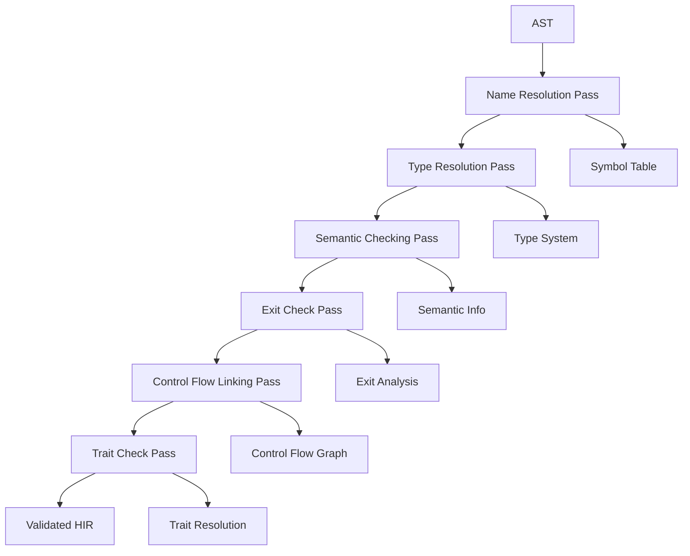

# Semantic Analysis Overview

Semantic Analysis is the middle phase of the RCompiler pipeline, responsible for transforming the syntactic structure (AST) into a semantically valid High-Level Intermediate Representation (HIR). This phase ensures that the program is not just syntactically correct but also meaningful according to the language's type system and semantic rules.

## Architecture

RCompiler implements semantic analysis as a **multi-pass transformation system** inspired by rustc's query-based approach. Each pass focuses on specific semantic concerns and builds upon the results of previous passes, gradually enriching the AST with semantic information until it becomes a fully resolved HIR.

## Core Components

### Semantic Analysis Framework

The semantic analysis system consists of several interconnected components:

- **Type System** ([`src/semantic/type/`](../../src/semantic/type/)): Type definitions, resolution, and operations
- **Symbol Table** ([`src/semantic/symbol/`](../../src/semantic/symbol/)): Name resolution and scope management
- **Constant Evaluation** ([`src/semantic/const/`](../../src/semantic/const/)): Compile-time computation and folding
- **HIR Generation** ([`src/semantic/hir/`](../../src/semantic/hir/)): AST to HIR transformation
- **Analysis Passes** ([`src/semantic/pass/`](../../src/semantic/pass/)): Individual semantic analysis transformations

### Type System ([`src/semantic/type/`](../../src/semantic/type/))

The type system provides the foundation for all semantic analysis:

#### Core Types ([`src/semantic/type/type.hpp`](../../src/semantic/type/type.hpp))
- **Primitive Types**: `i32`, `i64`, `f64`, `bool`, `str`, `char`
- **Composite Types**: Arrays `[T]`, tuples `(T, U)`, structs `Struct { ... }`
- **Function Types**: `fn(T) -> U`, `fn(T, U) -> V`
- **Generic Types**: Type parameters and instantiated generics
- **Type Variables**: For type inference and unification

#### Type Resolution ([`src/semantic/type/resolver.hpp`](../../src/semantic/type/resolver.hpp))
- **Type Inference**: Automatic type deduction from usage
- **Type Unification**: Finding most general types for expressions
- **Subtyping**: Checking type compatibility and relationships
- **Generic Instantiation**: Creating concrete types from generic definitions

#### Implementation Table ([`src/semantic/type/impl_table.hpp`](../../src/semantic/type/impl_table.hpp))
- **Trait Implementations**: Mapping from types to implemented traits
- **Method Resolution**: Finding appropriate methods for types
- **Trait Bounds**: Checking generic constraints
- **Coercion Rules**: Implicit type conversions

#### Type Helpers ([`src/semantic/type/helper.hpp`](../../src/semantic/type/helper.hpp))
- **Type Utilities**: Common type operations and comparisons
- **Type Canonicalization**: Normalizing type representations
- **Type Printing**: Human-readable type formatting

### Symbol Table Management ([`src/semantic/symbol/`](../../src/semantic/symbol/))

#### Scope Management ([`src/semantic/symbol/scope.hpp`](../../src/semantic/symbol/scope.hpp))
- **Hierarchical Scopes**: Nested lexical scopes
- **Symbol Resolution**: Name lookup with proper shadowing rules
- **Lifetime Tracking**: Variable lifetime and visibility
- **Import Resolution**: Module and use statement handling

#### Predefined Symbols ([`src/semantic/symbol/predefined.hpp`](../../src/semantic/symbol/predefined.hpp))
- **Built-in Types**: Primitive type definitions
- **Standard Library**: Predeclared functions and types
- **Language Features**: Compiler intrinsics and special forms

### Constant Evaluation ([`src/semantic/const/`](../../src/semantic/const/))

#### Constant Definitions ([`src/semantic/const/const.hpp`](../../src/semantic/const/const.hpp))
- **Constant Values**: Compile-time known values
- **Constant Expressions**: Evaluatable at compile time
- **Const Functions**: Functions that can be evaluated at compile time

#### Evaluator ([`src/semantic/const/evaluator.hpp`](../../src/semantic/const/evaluator.hpp))
- **Expression Folding**: Reducing constant expressions
- **Propagation**: Spreading constant values through code
- **Optimization**: Replacing expressions with their results

### HIR Generation ([`src/semantic/hir/`](../../src/semantic/hir/))

#### HIR Definition ([`src/semantic/hir/hir.hpp`](../../src/semantic/hir/hir.hpp))
- **High-Level IR**: More abstract than AST, closer to machine representation
- **Semantic Annotations**: Type information, resolved names, constant values
- **Control Flow**: Structured control flow constructs
- **Memory Layout**: Information about data organization

#### Converter ([`src/semantic/hir/converter.hpp`](../../src/semantic/hir/converter.hpp))
- **AST to HIR**: Transformation from syntactic to semantic representation
- **Type Annotation**: Adding type information to HIR nodes
- **Name Resolution**: Converting identifiers to resolved symbols
- **Semantic Validation**: Ensuring semantic correctness during conversion

#### Visitor Pattern ([`src/semantic/hir/visitor/`](../../src/semantic/hir/visitor/))
- **HIR Traversal**: Type-safe tree operations
- **Transformations**: HIR modifications and optimizations
- **Analysis**: Semantic information extraction

#### Pretty Printing ([`src/semantic/hir/pretty_print/`](../../src/semantic/hir/pretty_print/))
- **HIR Display**: Human-readable HIR output
- **Debugging**: Visualization of semantic analysis results
- **Documentation**: Generating code examples and explanations

## Semantic Analysis Passes

The semantic analysis is organized into distinct passes, each with specific responsibilities:

### 1. Name Resolution Pass ([`src/semantic/pass/name_resolution/`](../../src/semantic/pass/name_resolution/))

**Purpose**: Resolve all identifiers to their declarations and build the symbol table.

**Key Operations**:
- **Symbol Registration**: Collect all declarations into appropriate scopes
- **Reference Resolution**: Map identifier uses to their definitions
- **Import Handling**: Process module imports and use statements
- **Error Detection**: Find undefined variables and ambiguous references

**Invariants Established**:
- Every identifier reference points to a valid declaration
- Scope boundaries are properly enforced
- Import statements are correctly resolved

### 2. Type Resolution Pass ([`src/semantic/pass/type&const/`](../../src/semantic/pass/type&const/))

**Purpose**: Determine and annotate types for all expressions and declarations.

**Key Operations**:
- **Type Inference**: Deduce types from expressions and usage
- **Type Checking**: Verify type compatibility in operations
- **Generic Instantiation**: Create concrete types from generic definitions
- **Constant Evaluation**: Compute constant expressions at compile time

**Invariants Established**:
- Every expression has a known type
- Type compatibility is verified for all operations
- Generic types are properly instantiated
- Constant expressions are evaluated

### 3. Semantic Checking Pass ([`src/semantic/pass/semantic_check/`](../../src/semantic/pass/semantic_check/))

**Purpose**: Perform comprehensive semantic validation beyond type checking.

**Key Operations**:
- **Expression Checking**: Validate expression semantics and rules
- **Control Flow Analysis**: Verify control flow properties
- **Lifetime Checking**: Ensure proper variable lifetimes
- **Borrow Checking**: (Future) Reference and ownership validation

**Invariants Established**:
- All expressions follow language semantic rules
- Control flow is properly structured
- Variable lifetimes are correctly managed
- Memory safety rules are enforced

### 4. Exit Check Pass ([`src/semantic/pass/exit_check/`](../../src/semantic/pass/exit_check/))

**Purpose**: Validate function exit behavior and return statements.

**Key Operations**:
- **Return Path Analysis**: Ensure all functions have proper return paths
- **Return Type Checking**: Verify return value compatibility
- **Exit Validation**: Check function termination conditions

**Invariants Established**:
- All functions have valid return behavior
- Return types match function signatures
- No unreachable code exists

### 5. Control Flow Linking Pass ([`src/semantic/pass/control_flow_linking/`](../../src/semantic/pass/control_flow_linking/))

**Purpose**: Analyze and optimize control flow structures.

**Key Operations**:
- **Flow Graph Construction**: Build control flow graphs
- **Dominance Analysis**: Compute dominance relationships
- **Loop Analysis**: Identify loop structures and properties
- **Optimization Preparation**: Set up for future optimizations

**Invariants Established**:
- Control flow relationships are explicitly represented
- Loop structures are properly identified
- Optimization opportunities are marked

### 6. Trait Check Pass ([`src/semantic/pass/trait_check/`](../../src/semantic/pass/trait_check/))

**Purpose**: Validate trait implementations and trait bounds.

**Key Operations**:
- **Trait Implementation**: Verify proper trait method implementations
- **Bound Checking**: Ensure generic constraints are satisfied
- **Method Resolution**: Resolve trait method calls
- **Coercion Validation**: Check implicit conversions

**Invariants Established**:
- All trait implementations are complete and correct
- Generic bounds are properly satisfied
- Trait method calls are correctly resolved

## Data Flow Architecture



## Key Design Decisions

### Multi-Pass Architecture

Instead of monolithic semantic analysis, RCompiler uses separate passes:

**Benefits:**
- **Modularity**: Each pass focuses on specific concerns
- **Maintainability**: Easier to understand and modify individual analyses
- **Extensibility**: New analyses can be added as separate passes
- **Incremental Development**: Passes can be developed and tested independently
- **Optimization Opportunities**: Each pass can optimize for its specific domain

### Invariant-Based Design

Each pass establishes specific invariants that later passes can rely upon:

```cpp
// Example: Type Resolution Pass establishes type invariants
class TypeResolutionPass {
public:
    void process(ASTNode* node) {
        // After this pass:
        // - Every expression has a resolved type
        // - Type compatibility is verified
        // - Generic types are instantiated
        establish_type_invariants(node);
    }
    
private:
    void establish_type_invariants(ASTNode* node) {
        // Ensure all expressions have types
        // Verify type compatibility
        // Instantiate generics
    }
};
```

**Benefits:**
- **Clear Contracts**: Each pass has well-defined inputs and outputs
- **Reliable Composition**: Later passes can trust established invariants
- **Error Localization**: Problems can be traced to specific pass failures
- **Parallel Development**: Different teams can work on different passes

### Type System Design

Separate TypeId system from type definitions:

```cpp
// Type system with separate IDs
class TypeSystem {
public:
    TypeId create_primitive_type(PrimitiveKind kind);
    TypeId create_function_type(TypeId return_type, std::vector<TypeId> params);
    TypeId instantiate_generic(TypeId generic_type, std::vector<TypeId> args);
    
    const TypeInfo& get_type_info(TypeId id) const;
    bool is_subtype(TypeId sub, TypeId super) const;
    
private:
    std::vector<TypeInfo> types_;
    std::unordered_map<std::string, TypeId> type_names_;
};
```

**Benefits:**
- **Efficient Comparison**: TypeId comparison is O(1)
- **Memory Efficiency**: Type definitions are shared
- **Caching**: Type operations can be cached by TypeId
- **Unification**: Type inference algorithms work with TypeIds

### Visitor Pattern Implementation

CRTP-based visitor pattern for type-safe tree operations:

```cpp
template<typename Derived>
class HIRVisitor {
public:
    void visit(HIRNode* node) {
        node->accept(static_cast<Derived&>(*this));
    }
    
    // Default implementations
    void visit_expression(HIRExpression* expr) {
        // Default expression handling
    }
    
    void visit_statement(HIRStatement* stmt) {
        // Default statement handling
    }
};

class TypeChecker : public HIRVisitor<TypeChecker> {
public:
    void visit_binary_op(HIRBinaryOp* op) {
        // Type-specific binary operation checking
    }
    
    void visit_function_call(HIRFunctionCall* call) {
        // Function call type checking
    }
};
```

**Benefits:**
- **Type Safety**: Compile-time checking of visitor operations
- **Performance**: Static dispatch instead of virtual calls
- **Extensibility**: New node types easily added
- **Modularity**: Different visitors for different analyses

## Error Handling Strategy

### Comprehensive Error Reporting

```cpp
class SemanticError : public CompilerError {
public:
    SemanticError(const std::string& message,
                 const HIRNode* node,
                 ErrorKind kind,
                 const std::vector<Hint>& hints = {})
        : message_(format_error(message, node, kind)),
          node_(node),
          kind_(kind),
          hints_(hints) {}
    
    const std::string& message() const { return message_; }
    const HIRNode* node() const { return node_; }
    ErrorKind kind() const { return kind_; }
    const std::vector<Hint>& hints() const { return hints_; }
    
private:
    std::string message_;
    const HIRNode* node_;
    ErrorKind kind_;
    std::vector<Hint> hints_;
};
```

**Features:**
- **Precise Location**: Error location in source code
- **Error Categories**: Different kinds of semantic errors
- **Helpful Hints**: Suggestions for fixing errors
- **Error Recovery**: Continue analysis after errors
- **Error Aggregation**: Collect multiple errors per pass

## Performance Considerations

### Efficient Type Operations

- **Type Caching**: Cache type inference results
- **Canonicalization**: Normalize type representations
- **Interning**: Share common type definitions
- **Lazy Evaluation**: Defer expensive operations until needed

### Memory Management

- **Arena Allocation**: Use arena allocators for AST/HIR nodes
- **Smart Pointers**: RAII for automatic memory management
- **Move Semantics**: Efficient transfer of ownership
- **Reference Counting**: Shared ownership where appropriate

## Navigation

- **Implementation Details**: See [`src/semantic/`](../../src/semantic/) directory
- **Type System**: [`src/semantic/type/`](../../src/semantic/type/)
- **Analysis Passes**: [`src/semantic/pass/`](../../src/semantic/pass/)
- **HIR Definition**: [`src/semantic/hir/hir.hpp`](../../src/semantic/hir/hir.hpp:1)
- **Usage Examples**: Test files in [`test/semantic/`](../../test/semantic/)

## Related Documentation

- [AST Overview](./ast-overview.md) - Input to semantic analysis
- [Parser Overview](./parser-overview.md) - AST generation
- [Testing Overview](./testing-overview.md) - Semantic analysis testing
- [Architecture Guide](../architecture.md) - System-wide design decisions

## Usage Examples

### Basic Semantic Analysis
```cpp
// Create semantic analyzer
auto analyzer = SemanticAnalyzer();

// Analyze AST
auto result = analyzer.analyze(ast);

if (result.has_errors()) {
    for (const auto& error : result.errors()) {
        std::cerr << "Semantic error: " << error.message() << std::endl;
        std::cerr << "At " << error.node()->location() << std::endl;
    }
}

// Get validated HIR
auto hir = result.hir();
```

### Custom Analysis Pass
```cpp
class CustomAnalysisPass : public SemanticPass {
public:
    void process(HIRNode* node) override {
        // Custom semantic analysis logic
        if (auto* function = dynamic_cast<HIRFunction*>(node)) {
            analyze_function(function);
        }
    }
    
private:
    void analyze_function(HIRFunction* function) {
        // Function-specific analysis
        check_function_properties(function);
    }
};

// Register and run custom pass
auto custom_pass = std::make_unique<CustomAnalysisPass>();
analyzer.add_pass(std::move(custom_pass));
```

This semantic analysis design provides comprehensive validation while maintaining modularity and extensibility, making it suitable for educational purposes and future development.