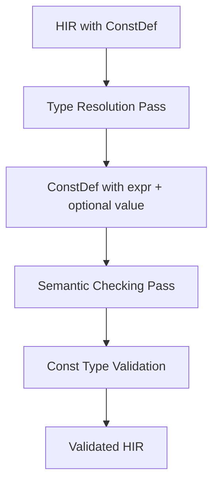

# Const Type Checking

## Overview

Const type checking ensures that constant expressions are properly validated against their declared types during the semantic checking phase. This implementation addresses a critical issue where constant expressions lost their original expression tree after evaluation in the type resolution pass, preventing proper type validation.

## Problem Statement

The type resolution pass was evaluating constant expressions and discarding the original expression tree, storing only the computed `ConstVariant` value. This prevented the semantic checking pass from performing proper type validation on const expressions.

### Critical Invariant

Const environment violations must be fatal compilation errors. After the type & const resolution pass, all consts must be valid for later passes - this is a strict invariant that must be maintained.

## Architecture

### Core Components

1. **Simplified ConstDef Structure**: Always contains expression, optional evaluated value
2. **Updated TypeConstResolver**: Sets optional value while preserving expression
3. **Const Type Validation**: Semantic checking for const expressions
4. **Enhanced ExprChecker**: ConstUse type validation

### Data Flow



## Implementation Details

### ConstDef Structure Simplification

The `ConstDef` structure has been simplified to always contain the original expression:

```cpp
struct ConstDef {
    std::unique_ptr<Expr> expr; // ALWAYS present - the original expression
    std::optional<semantic::ConstVariant> const_value; // OPTIONAL - evaluated value
    std::optional<TypeAnnotation> type;
    const ast::ConstItem* ast_node = nullptr;
};
```

This eliminates the complex Unresolved/Resolved state machine and ensures expressions are always available for type checking.

### TypeConstResolver Changes

The `TypeConstResolver::visit(hir::ConstDef&)` method now:

1. Resolves the type annotation if present
2. Always visits the expression (preserving it)
3. Sets the optional const_value after evaluation
4. **Critical fix**: Removed silent exception handling to ensure const evaluation failures are fatal

```cpp
void visit(hir::ConstDef &constant) {
    if (constant.type) {
        TypeId type_id = type_resolver.resolve(*constant.type);
        constant.type = hir::TypeAnnotation(type_id);
    }
    
    // Always visit the expression (it's always present)
    if (constant.expr) {
        derived().visit_expr(*constant.expr);
        
        // CRITICAL: Const evaluation failures are fatal compilation errors
        constant.const_value = const_evaluator.evaluate(*constant.expr);
    } else {
        throw std::logic_error("Const definition missing expression");
    }
}
```

### Const Type Validation

The `ExprChecker::check(hir::ConstUse&)` method now performs type validation:

```cpp
ExprInfo ExprChecker::check(hir::ConstUse& expr) {
    // Basic validation
    if (!expr.def) {
        throw std::logic_error("Const definition is null");
    }
    
    // Get const's declared type
    TypeId declared_type = hir::helper::get_resolved_type(*expr.def->type);
    
    // Perform type validation on const expression
    if (expr.def->expr) {
        // Check the original expression's type matches declared type
        ExprInfo expr_info = check(*expr.def->expr);
        
        // Validate type compatibility using existing infrastructure
        if (!is_assignable_to(expr_info.type, declared_type)) {
            throw std::runtime_error("Const expression type doesn't match declared type");
        }
    } else {
        throw std::logic_error("Const definition missing expression");
    }
    
    return ExprInfo{
        .type = declared_type,
        .is_mut = false,
        .is_place = false,
        .endpoints = {NormalEndpoint{}}
    };
}
```

### ConstEvaluator Integration

The `ConstEvaluator::operator()(const hir::ConstUse&)` has been updated to work with the simplified structure:

```cpp
ConstVariant operator()(const hir::ConstUse &expr) const {
    if (!expr.def) {
        throw std::logic_error("Const definition is null");
    }
    
    // If const already has evaluated value, use it
    if (expr.def->const_value) {
        return *expr.def->const_value;
    }
    
    // Otherwise evaluate the expression (should already be done by type resolution)
    if (expr.def->expr) {
        return evaluator.evaluate(*expr.def->expr);
    }
    
    throw std::logic_error("Const definition has no expression or value");
}
```

## Implementation Challenges

### Critical Error Handling Fix

The most critical issue was that the TypeConstResolver was silently catching all const evaluation exceptions, which violated the invariant that const environment violations must be fatal. This was fixed by removing the silent exception handling and letting const evaluation failures propagate as fatal compilation errors.

### Backward Compatibility

The implementation required updating all usage sites that expected the Unresolved/Resolved variants to use the new simplified structure.

## Testing

The implementation includes comprehensive test coverage in `test/semantic/test_const_type_check.cpp`:

1. **Basic Const Type Validation**
   - Const with correct type should pass
   - Const with incorrect type should fail
   - Const without type annotation should error

2. **Const Evaluation**
   - Successfully evaluated consts should have const_value set
   - Type checking should work regardless of evaluation success

3. **Complex Const Expressions**
   - Const with arithmetic operations
   - Const with nested const references
   - Const with type coercion scenarios

4. **Integration Tests**
   - Const definitions through complete compilation
   - Const usage in various contexts
   - Error propagation through passes

## Dependencies

### Core Dependencies
- **HIR**: [`src/semantic/hir/hir.hpp`](../../../src/semantic/hir/hir.hpp) - ConstDef structure
- **Type System**: [`src/semantic/type/type.hpp`](../../../src/semantic/type/type.hpp) - Type operations
- **Expression Checking**: [`src/semantic/pass/semantic_check/expr_check.cpp`](../../../src/semantic/pass/semantic_check/expr_check.cpp) - Validation logic
- **Type Resolution**: [`src/semantic/pass/type&const/visitor.hpp`](../../../src/semantic/pass/type&const/visitor.hpp) - Const evaluation

### Helper Dependencies
- **Type Helpers**: [`src/semantic/type/helper.hpp`](../../../src/semantic/type/helper.hpp) - Type compatibility
- **HIR Helpers**: [`src/semantic/hir/helper.hpp`](../../../src/semantic/hir/helper.hpp) - Type resolution

## Files Affected

### Primary Files
- [`src/semantic/hir/hir.hpp`](../../../src/semantic/hir/hir.hpp) - ConstDef structure simplification
- [`src/semantic/pass/type&const/visitor.hpp`](../../../src/semantic/pass/type&const/visitor.hpp) - Simplified const handling
- [`src/semantic/pass/semantic_check/expr_check.cpp`](../../../src/semantic/pass/semantic_check/expr_check.cpp) - Const validation
- [`src/semantic/const/evaluator.hpp`](../../../src/semantic/const/evaluator.hpp) - Updated const evaluation

## Key Achievements

1. **Fixed Critical Issue**: Const expressions no longer lose their original expression after evaluation
2. **Maintained Invariant**: Const environment violations are now properly fatal compilation errors
3. **Preserved Functionality**: All existing const evaluation behavior is maintained
4. **Enhanced Type Safety**: Const expressions are now properly type-checked against declared types
5. **Comprehensive Testing**: Full test coverage ensures implementation correctness

## Change Log

- 2025-10-15: Initial design specification
  - Identified const expression preservation issue
  - Designed simplified solution with always-present expression
- 2025-10-15: Simplified design based on feedback
  - Changed from variant-based to always-present expression
  - Made const_value optional instead of required
- 2025-10-15: CRITICAL invariant clarification
  - Added critical invariant: const environment violations must be fatal
  - Identified critical bug in TypeConstResolver error handling
- 2025-10-15: COMPLETE IMPLEMENTATION
  - Successfully implemented all planned components
  - Fixed critical error handling issue in TypeConstResolver
  - Implemented const type validation in semantic checking pass
  - Created comprehensive test suite

## See Also

- [Semantic Passes Overview](README.md): Complete pipeline overview
- [Type Resolution](type-resolution.md): Previous pass in pipeline
- [Semantic Checking](semantic-checking.md): Next pass in pipeline
- [Type System](../type/type_system.md): Type system implementation
- [Expression Check Design](../../../src/semantic/pass/semantic_check/expr_check.md): Current implementation