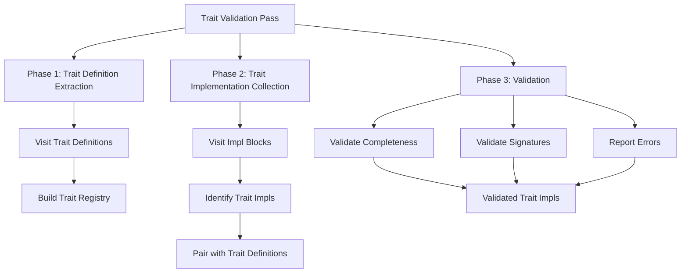

# Trait Validation Pass Implementation Guide

## Overview

The Trait Validation Pass is a dedicated semantic analysis pass that validates trait implementations against their trait definitions. This pass runs after Type & Const Finalization to ensure all type annotations are resolved before validation begins.

**Purpose**: Validate that all trait implementations correctly implement required items with matching signatures
**Scope**: Trait definition extraction and trait implementation validation
**Position**: Runs after Type & Const Finalization, before Semantic Checking

## Architecture

### Core Components

1. **TraitValidator Class**
   - Main visitor class inheriting from `hir::HirVisitorBase<TraitValidator>`
   - Traverses HIR to extract trait definitions and validate implementations
   - Maintains trait registry and pending implementations

2. **Trait Registry**
   - Maps trait definitions to their required items
   - Stores item signatures for efficient validation
   - Enables O(1) lookup during validation

3. **Validation Engine**
   - Performs signature matching using TypeId equality
   - Validates completeness (all required items implemented)
   - Reports detailed validation errors

### Data Structures

```cpp
struct TraitItemInfo {
    ast::Identifier name;
    std::variant<hir::Function*, hir::Method*, hir::ConstDef*> item;
    // TypeId information extracted during trait definition processing
};

struct TraitInfo {
    hir::Trait* trait_def;
    std::unordered_map<ast::Identifier, TraitItemInfo, IdentifierHasher> required_items;
};
```

### Validation Pipeline



## Implementation Guide

### Phase 1: Trait Definition Extraction

**Goal**: Build registry of all trait definitions and their required items

**Steps**:
1. Visit all `hir::Trait` nodes in the HIR
2. Extract trait items (functions, methods, constants)
3. Store item information in trait registry
4. Validate trait definition structure

**Key Method**: `extract_trait_definition(hir::Trait& trait)`

### Phase 2: Trait Implementation Collection

**Goal**: Identify and collect all trait implementations

**Steps**:
1. Visit all `hir::Impl` blocks
2. Identify trait implementations (check `impl.trait` field)
3. Pair implementations with their trait definitions
4. Queue for validation

**Key Method**: `visit(hir::Impl& impl)`

### Phase 3: Validation

**Goal**: Validate each trait implementation against its definition

**Validation Rules**:
1. **Completeness**: All required trait items must be implemented
2. **Name Matching**: Implementation item names must match trait item names
3. **Type Matching**: Item types must match (Function↔Function, Method↔Method, etc.)
4. **Signature Matching**: Parameter counts and TypeIds must match exactly

**Key Methods**:
- `validate_trait_impl(hir::Impl& impl, hir::Trait& trait)`
- `validate_function_signature(const hir::Function& trait_fn, const hir::Function& impl_fn)`
- `validate_method_signature(const hir::Method& trait_method, const hir::Method& impl_method)`
- `validate_const_signature(const hir::ConstDef& trait_const, const hir::ConstDef& impl_const)`

## Validation Algorithms

### Function Signature Validation

```cpp
bool validate_function_signature(const hir::Function& trait_fn, const hir::Function& impl_fn) {
    // Check parameter count
    if (trait_fn.param_type_annotations.size() != impl_fn.param_type_annotations.size()) {
        return false;
    }
    
    // Check return type TypeId equality
    auto trait_return_type = get_resolved_type(trait_fn.return_type);
    auto impl_return_type = get_resolved_type(impl_fn.return_type);
    if (trait_return_type != impl_return_type) {
        return false;
    }
    
    // Check parameter type TypeId equality
    for (size_t i = 0; i < trait_fn.param_type_annotations.size(); ++i) {
        auto trait_param_type = get_resolved_type(trait_fn.param_type_annotations[i]);
        auto impl_param_type = get_resolved_type(impl_fn.param_type_annotations[i]);
        if (trait_param_type != impl_param_type) {
            return false;
        }
    }
    
    return true;
}

### Method Signature Validation

```cpp
bool validate_method_signature(const hir::Method& trait_method, const hir::Method& impl_method) {
    // Similar to function validation but with method-specific considerations
    // Check receiver type (self parameter) if applicable
    // Check parameter count and TypeIds
    // Check return type TypeId
}
```

### Const Signature Validation

```cpp
bool validate_const_signature(const hir::ConstDef& trait_const, const hir::ConstDef& impl_const) {
    // Check const type TypeId equality
    if (trait_const.type && impl_const.type) {
        auto trait_type = get_resolved_type(*trait_const.type);
        auto impl_type = get_resolved_type(*impl_const.type);
        if (trait_type != impl_type) {
            return false;
        }
    }
    return true;
}
```

## Error Handling

### Error Types

1. **Missing Item Errors**
   - "Trait 'Display' requires method 'to_string' but it's not implemented"
   - "Trait 'Iterator' requires associated type 'Item' but it's not provided"

2. **Signature Mismatch Errors**
   - "Method 'to_string' parameter count (2) doesn't match trait definition (1)"
   - "Method 'to_string' return type TypeId(123) doesn't match expected TypeId(456)"
   - "Parameter 0 type TypeId(789) doesn't match expected TypeId(101) in method 'to_string'"

3. **Type Mismatch Errors**
   - "Item 'to_string' type (Method) doesn't match trait definition (Function)"
   - "Const 'PI' type TypeId(555) doesn't match expected TypeId(666)"

### Error Reporting Strategy

- Use `std::runtime_error` for user-facing validation errors
- Include trait name, item name, and specific mismatch details
- Provide TypeId values for debugging
- Use `std::logic_error` for internal consistency issues

## Input Requirements

**From Type & Const Finalization Pass**:
- All type annotations resolved to `TypeId` variants
- All trait definitions resolved and accessible
- All impl blocks have resolved `for_type` and `trait` fields
- All function/method signatures have resolved type annotations

## Output Guarantees

**For Semantic Checking Pass**:
- All trait implementations are validated and correct
- ImplTable contains only valid trait implementations
- Trait impl items can be safely used in type checking
- All required trait items are accessible through ImplTable

## Implementation Challenges

### Challenge 1: TypeId Resolution

**Problem**: Need to extract TypeId from resolved TypeAnnotation variants

**Solution**: Use helper function `get_resolved_type(const TypeAnnotation& annotation)` that:
- Checks if annotation contains TypeId variant
- Returns TypeId if present
- Throws logic_error if not resolved (invariant violation)

### Challenge 2: Trait-Impl Pairing

**Problem**: Need to match trait implementations with correct trait definitions

**Solution**: During impl visitation:
1. Check if `impl.trait` field contains resolved `hir::Trait*`
2. Use the trait pointer to look up trait info in registry
3. Validate that trait definition exists

### Challenge 3: Item Type Matching

**Problem**: Need to ensure implementation item types match trait item types

**Solution**: Use variant type checking:
- Compare variant indices first (fast check)
- Then perform specific validation based on item type
- Handle Function, Method, and ConstDef separately

## Dependencies

### Core Dependencies
- **HIR**: [`semantic/hir/hir.hpp`](../../hir/hir.hpp) - Trait and Impl definitions
- **Type System**: [`semantic/type/type.hpp`](../../type/type.hpp) - TypeId definitions
- **Visitor Base**: [`semantic/hir/visitor/visitor_base.hpp`](../../hir/visitor/visitor_base.hpp) - Visitor pattern
- **Utils**: [`semantic/utils.hpp`](../../utils.hpp) - Helper functions and Overloaded

### External Dependencies
- **ImplTable**: [`semantic/type/impl_table.hpp`](../../type/impl_table.hpp) - For storing validated trait implementations
- **Type Helpers**: [`semantic/type/helper.hpp`](../../type/helper.hpp) - Type utility functions

## Performance Characteristics

- **Time Complexity**: O(N + M) where N = number of trait definitions, M = number of trait implementations
- **Space Complexity**: O(N) for trait registry storage
- **Validation Cost**: O(K) per trait implementation where K = number of required items

## Future Work

### Potential Enhancements
1. **Trait Supertrait Support**: Handle trait inheritance and supertrait requirements
2. **Generic Trait Support**: Support for generic traits with type parameters
3. **Default Implementation Support**: Handle trait items with default implementations
4. **Associated Types**: Support for associated type definitions and implementations

### Optimization Opportunities
1. **Lazy Validation**: Validate trait implementations only when needed
2. **Parallel Processing**: Validate multiple trait implementations in parallel
3. **Incremental Validation**: Support for incremental revalidation of changed traits

## Files Affected

- **New Files**:
  - `src/semantic/pass/trait_check/trait_check.hpp` - Main trait validator class
  - `src/semantic/pass/trait_check/trait_check.cpp` - Implementation (if split)
  
- **Modified Files**:
  - `docs/semantic/passes/README.md` - Add trait validation to pipeline
  - `src/semantic/type/impl_table.hpp` - Update to handle validated trait implementations
  
- **Updated Documentation**:
  - `docs/semantic/passes/trait-validation.md` - Move this doc to docs/ after completion

## Change Log

- **2025-10-15**: Initial design and implementation plan created
  - Simplified validation using TypeId equality comparison
  - Focused on core trait validation without advanced features
  - Designed as separate pass after Type & Const Finalization