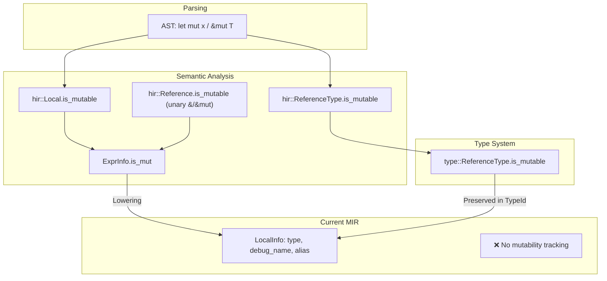

# Mutability Preservation in MIR

## Current State: Where Mutability Lives



---

## Mutability Sources (What We Have)

### 1. Variable Bindings (`let` vs `let mut`)

**Location:** `hir::Local.is_mutable` (line 103, `hir.hpp`)

```cpp
struct Local {
    ast::Identifier name;
    bool is_mutable;  // ← THIS
    std::optional<TypeAnnotation> type_annotation;
    // ...
};
```

**Semantic check:** `ExprInfo.is_mut` (line 156, `expr_info.hpp`)

```cpp
struct ExprInfo {
    TypeId type = invalid_type_id;
    bool is_mut = false;  // ← Computed from Local.is_mutable or reference mutability
    bool is_place = false;
    // ...
};
```

### 2. Reference Types (`&T` vs `&mut T`)

**Location:** `type::ReferenceType.is_mutable` (line 49-56, `type.hpp`)

```cpp
struct ReferenceType {
    TypeId referenced_type = invalid_type_id;
    bool is_mutable = false;  // ← THIS
};
```

**Helpers:**
- `type_helper::is_mutable_reference(TypeId)` - check if type is `&mut T`
- `type_helper::get_reference_mutability(TypeId)` - extract mutability from ref type
- `type_helper::create_reference_type(TypeId, bool is_mutable)` - create ref type

### 3. Reference Operators (`&expr` vs `&mut expr`)

**Location:** `hir::Reference.is_mutable` (used in UnaryExpr)

```cpp
// In converter.cpp:
case ast::UnaryExpr::REFERENCE: 
    hir_op = hir::Reference{.is_mutable = false}; 
case ast::UnaryExpr::MUTABLE_REFERENCE: 
    hir_op = hir::Reference{.is_mutable = true};
```

---

## Current MIR Gap

The current `mir::LocalInfo` (line 32-41, `mir.hpp`) does **NOT** track mutability:

```cpp
struct LocalInfo {
    TypeId type = invalid_type_id;
    std::string debug_name;
    bool is_alias = false;
    std::variant<std::monostate, TempId, AbiParamIndex> alias_target;
    // ❌ NO is_mutable field!
};
```

### What's Preserved vs Lost

| Information | Preserved in MIR? | Location |
|-------------|-------------------|----------|
| `&T` vs `&mut T` | ✅ YES | Via `TypeId` (ReferenceType encodes mutability) |
| `let x` vs `let mut x` | ❌ NO | Lost during lowering |
| Reference to mutable local | ✅ Partial | Type is `&mut T`, but local's own mutability lost |

---

## Why This Matters for Optimization

### Alias Analysis

For Memory-SSA and alias analysis, we need to know:

1. **`&mut T` exclusivity**: A `&mut T` reference has exclusive access to its target
2. **`&T` sharing**: Multiple `&T` references can coexist (no mutation through them)

This is critical for:
- **Load/Store forwarding**: Can we skip a load if we know no store happened?
- **Dead store elimination**: Is this store observable?
- **TBAA (Type-Based Alias Analysis)**: `&mut T` can't alias other `&T` to same location

### Current Limitation

Since reference mutability IS preserved in TypeId, we can query:
```cpp
type_helper::is_mutable_reference(local.type)  // Works for &T / &mut T
```

But for **value locals** (not references), we lose whether `let x` vs `let mut x`:
```rust
let x = 5;      // immutable - semantic guarantee: x never changes after init
let mut y = 5;  // mutable
```

If we preserve this, we get **free optimization info**: an immutable local can be treated as `const` after initialization.

---

## Proposed Changes

### Option A: Extend LocalInfo (Minimal Change)

```cpp
struct LocalInfo {
    TypeId type = invalid_type_id;
    std::string debug_name;
    bool is_mutable = false;  // ← ADD THIS
    bool is_alias = false;
    std::variant<std::monostate, TempId, AbiParamIndex> alias_target;
};
```

**Pros:** Simple, direct
**Cons:** Doesn't scale if we need more annotations

### Option B: TypeAnnotation Wrapper (From backend.md)

```cpp
struct TypeAnnotation {
    TypeId base_type;
    bool is_mutable = false;      // For locals AND reference types
    bool may_escape = false;      // For alias analysis
};

struct LocalInfo {
    TypeAnnotation annotation;  // ← REPLACES TypeId type
    std::string debug_name;
    // ...
};
```

**Pros:** Extensible, supports future escape analysis
**Cons:** More invasive change

### Recommendation: Start with Option A

1. Add `bool is_mutable` to `LocalInfo`
2. Propagate from `hir::Local.is_mutable` during lowering
3. Later, if we need escape tracking, refactor to `TypeAnnotation`

---

## Implementation Points

### 1. MIR Lowering (`lower/lower.cpp`)

When creating a LocalInfo for a HIR Local:
```cpp
LocalInfo info;
info.type = resolve_type(hir_local.type_annotation);
info.debug_name = hir_local.name.name;
info.is_mutable = hir_local.is_mutable;  // ← ADD THIS
```

### 2. Reference Type Mutability

Already preserved! The TypeId for `&mut T` encodes mutability:
```cpp
// To check if a local holds a mutable reference:
if (auto ref = std::get_if<ReferenceType>(&get_type_from_id(local.type).value)) {
    bool is_mut_ref = ref->is_mutable;
}
```

### 3. Memory-SSA Usage

When building alias analysis:
```cpp
bool may_write_through(LocalId local, const MirFunction& fn) {
    const auto& info = fn.get_local_info(local);
    
    // Immutable value local: never written after init
    if (!info.is_mutable && !type_helper::is_reference_type(info.type)) {
        return false;  // Can't be target of any store
    }
    
    // Immutable reference: can't write through it
    if (type_helper::is_reference_type(info.type) && 
        !type_helper::is_mutable_reference(info.type)) {
        return false;
    }
    
    return true;  // May be written
}
```

---

## Summary

| What | Where Now | MIR Status | Action |
|------|-----------|------------|--------|
| `&T` vs `&mut T` | `type::ReferenceType` | ✅ Preserved via TypeId | None needed |
| `let` vs `let mut` | `hir::Local.is_mutable` | ❌ Lost | Add to `LocalInfo` |
| `&expr` vs `&mut expr` | `hir::Reference` | ✅ Result type encodes it | None needed |
| `ExprInfo.is_mut` | Semantic analysis | N/A (checking only) | Query during lowering |

**Immediate TODO:**
1. Add `bool is_mutable` to `mir::LocalInfo`
2. Propagate during lowering from `hir::Local.is_mutable`
3. Use in Memory-SSA for alias analysis
