# HIR Pretty Printer Design

## Overview

This document outlines the design for a pretty printer for the HIR (High-level Intermediate Representation) that produces debug-focused output showing internal details like pointer addresses, type IDs, and AST node addresses for memory debugging purposes.

## Purpose

The HIR pretty printer is designed to:
- Provide detailed debugging information for semantic analysis results
- Show resolved references and type information throughout the HIR
- Display internal pointer values for memory debugging
- Maintain structured, indented output for readability
- Follow the existing AST pretty printer pattern for consistency

## Architecture

### Core Components

1. **HirPrettyPrinter Class**: Main printer class with indentation management
2. **Visitor Structs**: Separate visitor structs for each HIR node category
3. **Helper Functions**: Utilities for printing resolved references and type information
4. **Stream Operators**: Convenient operators for easy usage

### Architecture Diagram

```mermaid
graph TD
    A[HirPrettyPrinter] --> B[IndentGuard]
    A --> C[HirExprVisitor]
    A --> D[HirStmtVisitor]
    A --> E[HirItemVisitor]
    A --> F[HirTypeVisitor]
    A --> G[HirPatternVisitor]
    
    A --> H[Helper Functions]
    H --> I[print_pointer]
    H --> J[print_type_annotation]
    H --> K[print_expr_info]
    
    C --> L[Literal Visitor]
    C --> M[Variable Visitor]
    C --> N[BinaryOp Visitor]
    C --> O[Call Visitor]
    C --> P[... other expressions]
    
    D --> Q[LetStmt Visitor]
    D --> R[ExprStmt Visitor]
    D --> S[... other statements]
    
    E --> T[Function Visitor]
    E --> U[StructDef Visitor]
    E --> V[EnumDef Visitor]
    E --> W[... other items]
    
    F --> X[PrimitiveType Visitor]
    F --> Y[ArrayType Visitor]
    F --> Z[ReferenceType Visitor]
    F --> AA[... other types]
    
    G --> BB[BindingDef Visitor]
    G --> CC[ReferencePattern Visitor]
    G --> DD[... other patterns]
    
    EE[Stream Operators] --> A
    FF[Main Entry Points] --> A
```



### Design Patterns

- **Visitor Pattern**: Uses standard visitor pattern with method overloads for each node type
- **RAII Indentation**: IndentGuard class manages indentation levels automatically
- **Template Helpers**: Reusable templated helper methods for common printing patterns

## Key Design Decisions

### 1. Debug-Focused Output Format

The pretty printer will emphasize debug information:
- **Pointer Addresses**: Show actual pointer values for resolved references
- **Type IDs**: Display resolved TypeId values for type annotations
- **AST Node Addresses**: Include AST node addresses for memory debugging
- **Expression Info**: Show ExprInfo details including type, mutability, and endpoints

### 2. HIR-Specific Features

The printer handles HIR-specific constructs:
- **Resolved References**: Display Local*, Function*, StructDef* pointers
- **TypeAnnotation Variant**: Handle both TypeNode* and TypeId variants
- **Expression Information**: Show ExprInfo with type and control flow details
- **Canonical Forms**: Display normalized HIR structures

### 3. Visitor Implementation Strategy

Following project conventions:
- **Standard Visitor Pattern**: Main visitor class with method overloads
- **No Auto Lambdas**: Avoid template-heavy lambda visitors
- **Separate Visitor Structs**: Organized by node category (Expr, Stmt, Item, etc.)

## Implementation Structure

### Class Hierarchy

```cpp
class HirPrettyPrinter {
    // Core printing functionality
    void print_program(const Program& program);
    void print_item(const Item& item);
    void print_stmt(const Stmt& stmt);
    void print_expr(const Expr& expr);
    void print_type_node(const TypeNode& type_node);
    void print_pattern(const Pattern& pattern);
    
    // Helper methods
    void print_type_annotation(const TypeAnnotation& annotation);
    void print_expr_info(const std::optional<ExprInfo>& info);
    void print_pointer(const void* ptr, const char* type_name);
    
private:
    class IndentGuard; // RAII indentation management
    std::ostream& out_;
    int indent_level_;
};

// Visitor structs for each node category
struct HirExprVisitor { /* ... */ };
struct HirStmtVisitor { /* ... */ };
struct HirItemVisitor { /* ... */ };
struct HirTypeVisitor { /* ... */ };
struct HirPatternVisitor { /* ... */ };
```

### Output Format Examples

```cpp
// Variable reference
Variable {
  local_id: 0x55f8a7b3d2a0 // Local*
  ast_node: 0x55f8a7b3c100 // PathExpr*
}

// Function call
Call {
  callee: // Expr
  args: [
    // Expr 1
    // Expr 2
  ]
  ast_node: 0x55f8a7b3d200 // CallExpr*
  expr_info: {
    type: TypeId(42)
    is_mut: false
    is_place: false
    endpoints: {Normal}
  }
}

// Type annotation
TypeAnnotation: TypeId(24) // Resolved type
// or
TypeAnnotation: // Unresolved TypeNode
  PrimitiveType {
    kind: I32
    ast_node: 0x55f8a7b3d300
  }
```

### Pointer Display Strategy

For all HIR objects that can be referenced by pointers:
1. **Definition Display**: Show the object's address when it's defined: `Function@0x55f8a7b3e000`
2. **Reference Display**: Show both pointer and target when referenced: `0x55f8a7b3e000 -> Function@0x55f8a7b3e000`
3. **Consistent Addressing**: The pointer value and target address will always match for valid references

This approach allows you to:
- Easily trace what each pointer points to
- Verify pointer correctness during debugging
- Identify memory issues by checking address consistency
- Quickly locate object definitions from their references

## Implementation Strategy

### Phase 1: Core Infrastructure
1. Create HirPrettyPrinter class with basic structure
2. Implement IndentGuard for RAII indentation
3. Add basic helper methods for common patterns
4. Set up visitor struct definitions

### Phase 2: Node Visitors
1. Implement expression visitors (most complex)
2. Implement statement visitors
3. Implement item visitors
4. Implement type node visitors
5. Implement pattern visitors

### Phase 3: Integration & Polish
1. Add stream operators for convenience
2. Add helper functions for resolved references
3. Create comprehensive documentation
4. Add basic tests

## Dependencies

### Required Dependencies
- `src/semantic/hir/hir.hpp` - HIR node definitions
- `src/semantic/hir/helper.hpp` - HIR helper functions
- `src/semantic/hir/visitor/visitor_base.hpp` - Visitor base class
- `src/semantic/utils.hpp` - Overloaded helper
- `src/semantic/pass/semantic_check/expr_info.hpp` - ExprInfo definitions

### Optional Dependencies
- `src/semantic/type/type.hpp` - Type system details
- `src/ast/common.hpp` - AST node types

## Integration Points

### With Existing Code
- Follows AST pretty printer pattern in `src/ast/pretty_print/pretty_print.hpp`
- Uses HIR visitor pattern from `src/semantic/hir/visitor/visitor_base.hpp`
- Leverages helper functions from `src/semantic/hir/helper.hpp`

### Usage Pattern
```cpp
// Basic usage
std::cout << hir_program;

// Direct printer usage
HirPrettyPrinter printer(std::cout);
printer.print_program(hir_program);

// With custom stream
std::ostringstream oss;
oss << hir_expression;
```

## Future Enhancements

### Potential Improvements
1. **Output Modes**: Add flags for debug vs user-friendly output
2. **Filtering**: Options to show/hide certain details
3. **Color Coding**: Terminal colors for different node types
4. **Graph Format**: Dot/graphviz output generation
5. **Diff Support**: Compare two HIR structures

### Extensibility
- Plugin system for custom node formatters
- Configurable output formats
- Integration with debugging tools

## Implementation Challenges

### Resolved Reference Handling
- Must safely print pointer values without dereferencing
- Handle null pointers gracefully
- Show meaningful information for resolved references

### Type Information Display
- Handle both resolved TypeId and unresolved TypeNode
- Show type relationships clearly
- Display complex type structures (arrays, references, etc.)

### Expression Information
- Display ExprInfo details clearly
- Show control flow endpoints
- Handle optional ExprInfo gracefully

## Testing Strategy

### Unit Tests
- Test each visitor method individually
- Verify output format consistency
- Test edge cases (null pointers, empty collections)

### Integration Tests
- Test with complete HIR programs
- Verify complex structures print correctly
- Test with real semantic analysis output

### Performance Tests
- Ensure large HIR structures print efficiently
- Verify memory usage is reasonable
- Test with deeply nested structures

## Files to be Created

1. `src/semantic/hir/pretty_print/pretty_print.hpp` - Main implementation
2. `docs/semantic/hir/pretty_print.md` - Documentation
3. `test/semantic/test_hir_pretty_print.cpp` - Basic tests

## Change Log

- 2025-10-17: Initial design document created