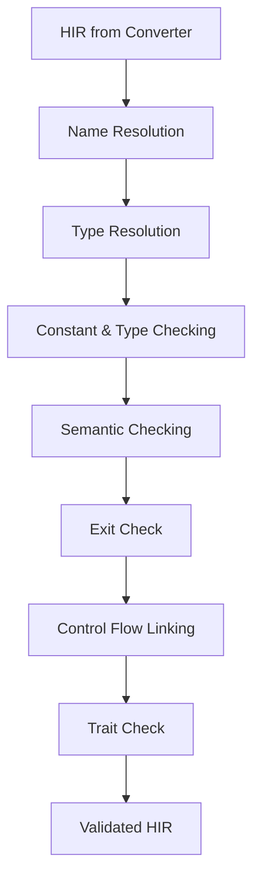
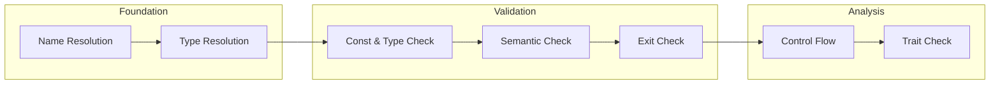

# Semantic Passes Overview

## Overview

Comprehensive overview of the semantic analysis pipeline, including all passes, their interactions, and the overall architecture of semantic processing in RCompiler.

## Pipeline Architecture

### Pass Order and Dependencies



### Pass Categories

1. **Foundation Passes**: Establish basic semantic information
   - Name Resolution: Resolve all identifiers to symbols
   - Type Resolution: Resolve all types to TypeId

2. **Validation Passes**: Validate semantic correctness
   - Constant & Type Checking: Type validation and constant evaluation
   - Semantic Checking: Comprehensive semantic validation
   - Exit Check: Validate function exit conditions

3. **Analysis Passes**: Advanced semantic analysis
   - Control Flow Linking: Build control flow information
   - Trait Check: Validate trait implementations

## Individual Pass Details

### Name Resolution Pass
**Purpose**: Resolve all identifiers to their corresponding symbols
- **Input**: HIR with unresolved identifiers
- **Output**: HIR with all identifiers resolved to symbols
- **Key Operations**:
  - Scope-based name lookup
  - Import resolution
  - Shadowing detection
  - Symbol table population

### Type Resolution Pass
**Purpose**: Resolve all type references to concrete TypeId values
- **Input**: HIR with unresolved type references
- **Output**: HIR with all types resolved to TypeId
- **Key Operations**:
  - Type name resolution
  - Generic type instantiation
  - Type parameter substitution
  - Type compatibility checking

### Constant & Type Checking Pass
**Purpose**: Perform type validation and constant evaluation
- **Input**: HIR with resolved types
- **Output**: HIR with type annotations and evaluated constants
- **Key Operations**:
  - Expression type checking
  - Constant folding
  - Type compatibility validation
  - Generic constraint checking

### Semantic Checking Pass
**Purpose**: Comprehensive semantic validation beyond types
- **Input**: HIR with type annotations
- **Output**: HIR with semantic validation complete
- **Key Operations**:
  - Variable usage validation
  - Function call validation
  - Assignment checking
  - Control flow validation

### Exit Check Pass
**Purpose**: Validate function and block exit conditions
- **Input**: HIR with semantic validation
- **Output**: HIR with exit validation complete
- **Key Operations**:
  - Return statement validation
  - Function exit path analysis
  - Unreachable code detection
  - Return type consistency

### Control Flow Linking Pass
**Purpose**: Build control flow information and analyze program flow
- **Input**: HIR with exit validation
- **Output**: HIR with control flow information
- **Key Operations**:
  - Basic block construction
  - Control flow graph building
  - Loop analysis
  - Reachability analysis

### Trait Check Pass
**Purpose**: Validate trait implementations and constraints
- **Input**: HIR with control flow information
- **Output**: HIR with trait validation complete
- **Key Operations**:
  - Trait implementation checking
  - Generic constraint validation
  - Method resolution
  - Trait bound verification

## Pass Interactions and Data Flow

### Information Flow Between Passes


### Shared Data Structures
- **HIR**: Modified in-place by each pass
- **Symbol Table**: Populated and refined throughout pipeline
- **Type System**: Enhanced with resolved type information
- **Error Context**: Accumulated across passes

## Pass Implementation Patterns

### Common Pass Structure
```cpp
class SemanticPass {
protected:
    TypeSystem& type_system;
    SymbolTable& symbol_table;
    ErrorReporter& error_reporter;
    
public:
    virtual void process(hir::Program& program) = 0;
    virtual void process_function(hir::Function& function) = 0;
    virtual void process_statement(hir::Stmt& stmt) = 0;
    virtual void process_expression(hir::Expr& expr) = 0;
    
    // Common utilities
    void report_error(const std::string& message, Position pos);
    void report_warning(const std::string& message, Position pos);
    bool is_valid_type(TypeId type_id) const;
};
```

### Pass Registration System
```cpp
class SemanticPassRegistry {
    std::vector<std::unique_ptr<SemanticPass>> passes;
    
public:
    template<typename PassType, typename... Args>
    void register_pass(Args&&... args) {
        passes.push_back(std::make_unique<PassType>(std::forward<Args>(args)...));
    }
    
    void run_all_passes(hir::Program& program) {
        for (auto& pass : passes) {
            pass->process(program);
        }
    }
};
```

## Error Handling Strategy

### Error Classification
1. **Fatal Errors**: Stop compilation immediately
   - Syntax errors in HIR
   - Critical semantic violations
   - Type system corruption

2. **Recoverable Errors**: Continue analysis but report issues
   - Type mismatches
   - Undefined symbols
   - Semantic violations

3. **Warnings**: Continue analysis with advisory messages
   - Unused variables
   - Unreachable code
   - Potential issues

### Error Accumulation
```cpp
class ErrorAccumulator {
    std::vector<SemanticError> errors;
    std::vector<SemanticWarning> warnings;
    size_t error_count = 0;
    size_t warning_count = 0;
    
public:
    void add_error(const SemanticError& error) {
        errors.push_back(error);
        error_count++;
    }
    
    void add_warning(const SemanticWarning& warning) {
        warnings.push_back(warning);
        warning_count++;
    }
    
    bool has_errors() const { return error_count > 0; }
    void report_all() const;
};
```

## Performance Considerations

### Pass Efficiency
- **Single-Pass Design**: Each pass focuses on specific concerns
- **Incremental Updates**: Only reprocess changed HIR nodes
- **Caching**: Cache analysis results across passes
- **Parallel Processing**: Independent passes can run in parallel

### Memory Management
- **In-Place Modification**: Modify HIR directly to reduce allocations
- **Smart Pointers**: Efficient memory management for pass objects
- **Resource Pooling**: Reuse temporary objects across passes

## Testing Strategy

### Pass-Specific Testing
- **Unit Tests**: Test individual pass functionality
- **Integration Tests**: Test pass interactions
- **Regression Tests**: Ensure pass behavior consistency
- **Performance Tests**: Measure pass execution time

### Test Data Management
```cpp
class SemanticTestSuite {
    std::vector<TestCase> test_cases;
    
public:
    void add_test_case(const std::string& name, 
                    const std::string& input,
                    const ExpectedResult& expected);
    
    void run_all_tests();
    void generate_test_report();
};
```

## Debugging and Diagnostics

### Pass Tracing
```cpp
class PassTracer {
    bool enabled = false;
    std::ostream& output;
    
public:
    void trace_pass(const std::string& pass_name);
    void trace_node(const hir::Node& node);
    void trace_operation(const std::string& operation);
    void trace_result(const std::string& result);
};
```

### Diagnostic Information
- **Pass Execution Time**: Measure time for each pass
- **Memory Usage**: Track memory consumption
- **Node Processing Count**: Count processed HIR nodes
- **Error Statistics**: Analyze error patterns

## Configuration and Extensibility

### Pass Configuration
```cpp
struct SemanticPassConfig {
    bool enable_constant_folding = true;
    bool enable_optimizations = false;
    bool strict_mode = false;
    size_t max_error_count = 100;
    std::vector<std::string> disabled_passes;
};
```

### Custom Pass Registration
```cpp
template<typename CustomPass>
void register_custom_pass(SemanticPassRegistry& registry) {
    static_assert(std::is_base_of_v<SemanticPass, CustomPass>);
    registry.register_pass<CustomPass>();
}
```

## Future Extensions

### Planned Passes
1. **Optimization Passes**: Various HIR optimizations
2. **Liveness Analysis**: Variable liveness analysis
3. **Data Flow Analysis**: Comprehensive data flow analysis
4. **Alias Analysis**: Pointer alias analysis

### Advanced Features
1. **Parallel Pass Execution**: Run independent passes in parallel
2. **Incremental Compilation**: Only reprocess changed parts
3. **Pass Scheduling**: Optimal pass ordering
4. **Custom Pass DSL**: Domain-specific language for pass definition

## Integration Points

### With Frontend
- **HIR Input**: Receive HIR from AST-to-HIR converter
- **Error Reporting**: Forward semantic errors to frontend
- **Source Mapping**: Maintain source location information

### With Backend
- **Validated HIR**: Provide validated HIR for code generation
- **Type Information**: Supply complete type information
- **Optimization Hints**: Provide optimization opportunities

### With Build System
- **Pass Registration**: Register passes with build system
- **Configuration**: Integrate with build configuration
- **Testing**: Integrate with test framework

## Best Practices

### Pass Design
1. **Single Responsibility**: Each pass has one clear purpose
2. **Idempotent**: Multiple executions yield same result
3. **Minimal Dependencies**: Reduce inter-pass dependencies
4. **Clear Interfaces**: Well-defined input/output contracts

### Error Handling
1. **Early Detection**: Catch errors as early as possible
2. **Clear Messages**: Provide actionable error messages
3. **Recovery**: Continue analysis when possible
4. **Context**: Preserve error context information

### Performance
1. **Efficient Algorithms**: Use appropriate algorithms
2. **Memory Awareness**: Minimize memory allocations
3. **Caching**: Cache expensive computations
4. **Profiling**: Profile and optimize hot paths

## See Also

- [Individual Pass Documentation](./): Detailed documentation for each pass
- [HIR Documentation](../hir/hir.md): HIR structure and operations
- [Type System](../type/type_system.md): Type system details
- [Symbol Management](../symbol/scope.md): Symbol table implementation
- [Semantic Analysis Overview](../../../docs/component-overviews/semantic-overview.md): High-level semantic analysis design